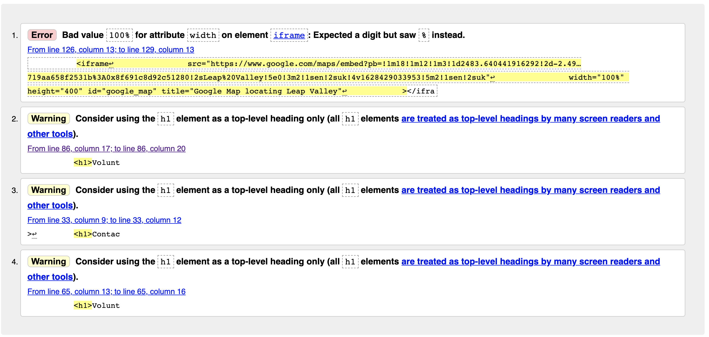
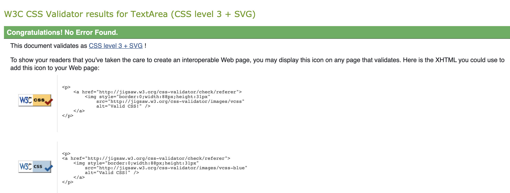

# Friends of Leap Valley

## Purpose

Leap Valley use a [simple site link](
http://www.simplesite.com/friendsofleapvalley/76040428) which is very basic and does not include responsive elements or details relating to the volunteer meeting times, or even sign up procedures for potential support from the local community in South Gloucestershire.  The site offers information regarding Leap Valley for visitors, but lacks the contextual links associated with the TVC (Tutoring Volunteering Community) in Bristol or volunteer meetings.  The previous meetings have lacked potential support from the local community, from failed attempts of using the monthly South Gloucestershire new letters.  

The purpose of the site is to increase the number of volunteers, offering images of the beautiful areas within Leap Valley and volunteering meeting slots, which users are able to sign up, using relevant locators, such as What3Words to assist the potential volunteers of the location of the meeting, within Leap Valley.  The site target audience range from young professionals to the retired community, who want to learn about tending to wildlife across the Leap Valley areas and able to transfer these skills into their own garden and nature.  The site should also emphasis where volunteers can support the recent Guerrilla gardening initiative.  

A range of media will support the sites purpose, with relevant navigation to images, video and text information.  The end result is a form element where volunteers can sign up to a wide-range of volunteer meetings which the main coordinators can use to ascertain number interest and time popularity for future events. 

### Initial site idea on the home page

## Links to Friends of Leap Valley
The link to the [GitHub File Directory](https://github.com/lpr78/3-Portfolio1)  
The link to the [Published site](https://lpr78.github.io/3-Portfolio1/)

## Media Screen Responsive Elements
The following show how the elements of the website current look at a responsive level:

#### Home page view
The following images shows how the contact us page looks at a responsive level: 

#### Meet us page view
The following images shows how the contact us page looks at a responsive level: 

#### Contact us page view
The following images shows how the contact us page looks at a responsive level: 

## Features used in website
<ul>
<li>images</li>
<li>video</li>
<li>form</li>
<li>text</li>
<li>map elements</li>
<li>icons</li>
<li>animated elements on images</li>
</ul>
Further details of web elements used below:   

### Navigation Header
The following navigation header has been used consistently across all three web pages.   

<ul>
<li>Appears at the top of each web page</li>
<li>Three links to home page, meet members and contact Friends of Leap Valley</li>
<li>High contrast with background image that is customised using Photoshop</li>
<li>Hover over identifies the desired location for the user</li>
<li>Strong emphasis on current page, to support user with page element currently displayed</li>
<li>Icons displayed to the right of the images to support identifying words, if translating text is difficult </li>
<li>Relevant logo that also links to the homepage</li>
</ul>
  
### Home Page Elements
The following image shows the main elements used on the home page (as of 19/08/2021)  

<ul>
<li>Leap Valley Map to showcase the multiple areas where volunteers can support</li>
<li>Video element demonstrated by volunteer to showcase popular areas and why they should volunteer</li>
<li>Responsive images with title tags to showcase the main areas - from Pexels and own images</li>
<li>Relevant titles and text to support what the volunteer would want to see on the home</li>
</ul>
  
### Members Elements
The following image shows the main elements used on the members page (as of 19/08/2021)  

 
<ul>
<li>Relevant titles and text to support celebrating recent qualification success from volunteers through TVC</li>
<li>Responsive images of volunteering activities - from Pexels and own images</li>
<li>Links to qualification to sell the volunteering opportunities</li>
</ul>
  

### Contact Us Elements
The following image shows the main elements used on the contact us page (as of 19/08/2021)  

 
<ul>
<li>Relevant titles and text to outline volunteer agenda for each time slot</li>
<li>Rbanner image utilised for date and form section from pexels and own images</li>
<li>form element to select volunteering meeting time</li>
<li>text block to sell the idea of volunteering</li>
</ul>
  
### Footer
The following footer has been used consistently across all three web pages.   

 
<ul>
<li>Appears at the bottom of each web page</li>
<li>Contains a google map element to locate Leap Valley, where Friends of Leap Valley volunteer</li>
<li>High contrast with background image that is customised using Photoshop which is the bottom section of the header image</li>
<li>Hover over identifies the social media icon to select, as well as contact number to call using VOIP</li>
<li>Strong emphasis on TVC link, to encourage volunteers to consider other opportunities around Bristol</li>
<li>Copyright notification to inform users of website creator</li>
<li>Relevant logo that also links to the homepage</li>
</ul>

## Testing 
### Accessibility Check - 08/08/2021

improved accessibility score based on title and alt update:

### Accessibility Check - 19/08/2021
With the additional elements relating to the form element and additions to the meet us page, the accessibility score has decreased and need updating to ensure screen readers can understand the labels, as shown below  

Improved accessibility score changing id names on form elements (contact us page)  

### W3C HTML Check Results - 31/08/2021
The following images shows some of the initial warnings and errors associated with the three web pages.  I used [W3C HTML validator](https://validator.w3.org/) the following The error message is consistent and will review with support. 

### W3C CSS Check Results - 31/08/2021
The results from the W3C CSS checker showcase no errors in the stylesheet.  

## Deployment and further development ideas

### Deployment
<ul>
<li>The link to the [GitHub File Directory](https://github.com/lpr78/3-Portfolio1) are the working files updated from GitPod </li>
<li>The link to the [Published site](https://lpr78.github.io/3-Portfolio1/) was updated via GitPod and frequently updated to GitHub</li>
</ul>

### Further development
The following ideas could be further developed:
<ul>
<li>Use a modal for map, rather than linking to the image located on the web server</li>
<li>Images could be placed into a scrollable gallery on the about us and members page to save space on the webpage itself</li>
<li>Fix the header at the top of each page to allow the user to reduce scrolling to access the menu</li>
<li>Develop a PHP link that supports the form rather than using the Code Institute POST link</li>
<li>Link the video to a YouTube server and embed, to improve performance score on lighthouse</li>
<li>Use some animated elements on images as long as this does not impact the performance score on the lighthouse</li>
</ul>

## Credits 

### References for image and accessibility content:
<li>https://www.pexels.com/</li>
<li>https://fonts.google.com/</li>
<li>https://validator.w3.org/</li>
<li>https://jigsaw.w3.org/css-validator/</li>
<li>https://web.dev/measure/</li>
<li>https://www.tcv.org.uk/about/</li>
<li>Creators own images and customisation of primary/copyright compliant sources via image editing software (Photoshop)</li>
  

### References for learning:
<li>https://github.com/Code-Institute-Org/gitpod-full-template</li>
<li>https://learn.codeinstitute.net/courses/course-v1:CodeInstitute+CSSE_PAGPPF+2021_Q2/courseware/66cf361c769a41d496f5001fae6f9be7/3b5cd5dc8313462aa5975a3c9b9a1a3c/</li>
<li>https://github.com/Code-Institute-Solutions/readme-template</li>
<li>https://stackoverflow.com/questions/37506841/html-for-put-a-label-in-bottom-of-an-image/37506883</li>

