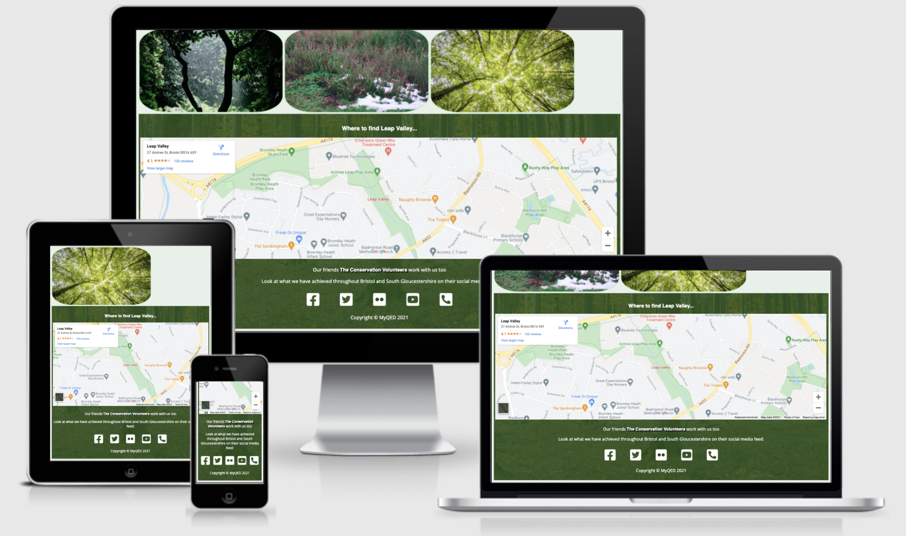
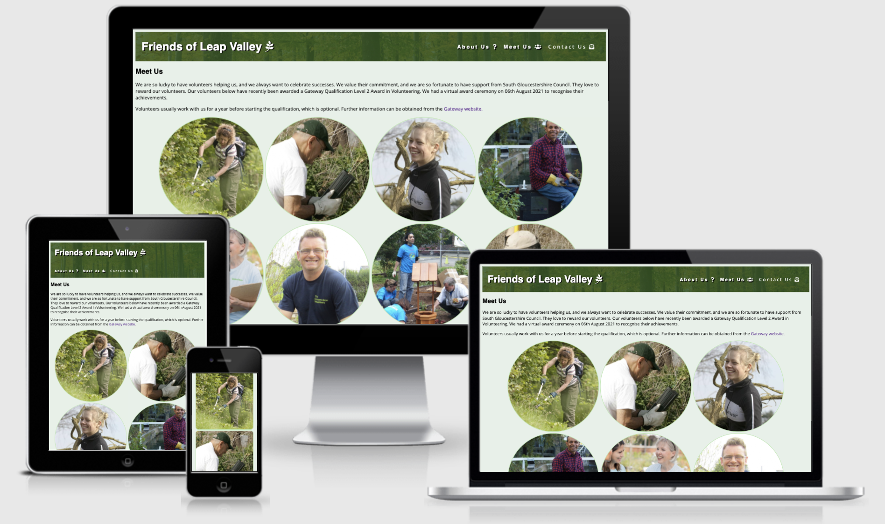
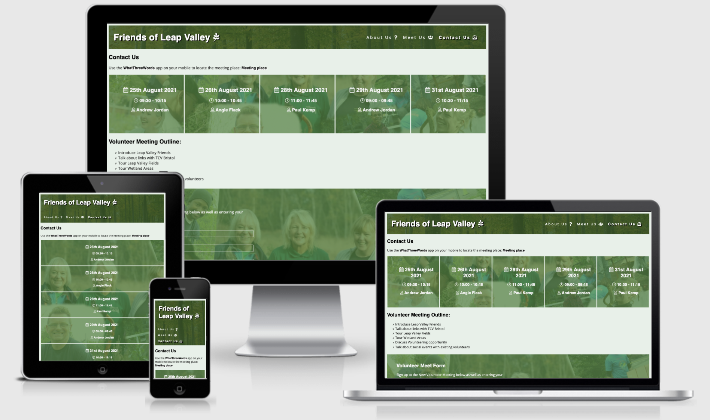
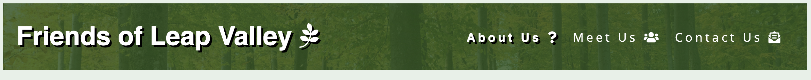
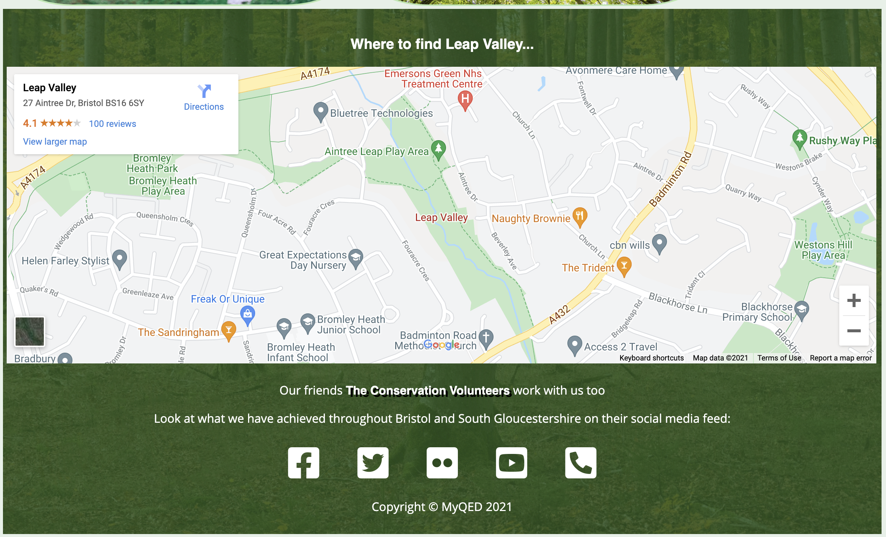
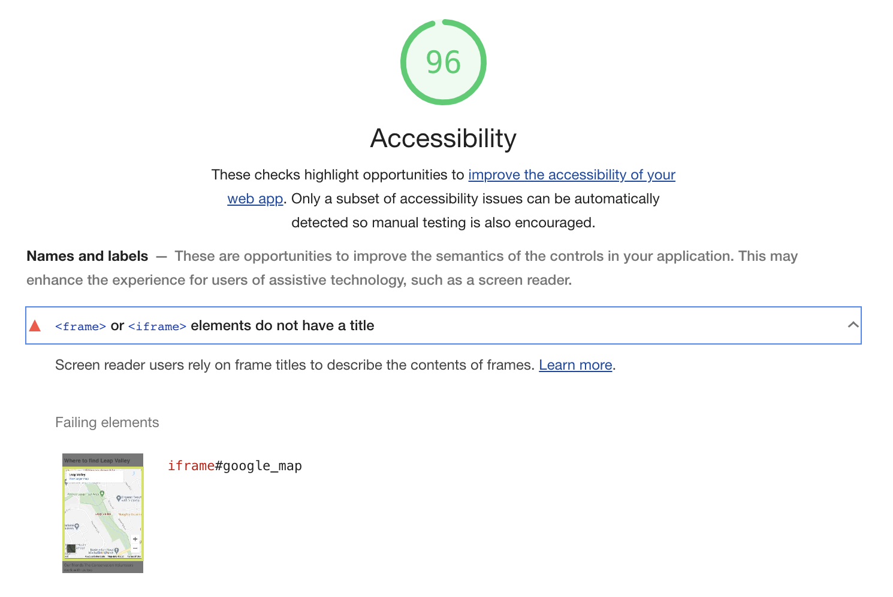
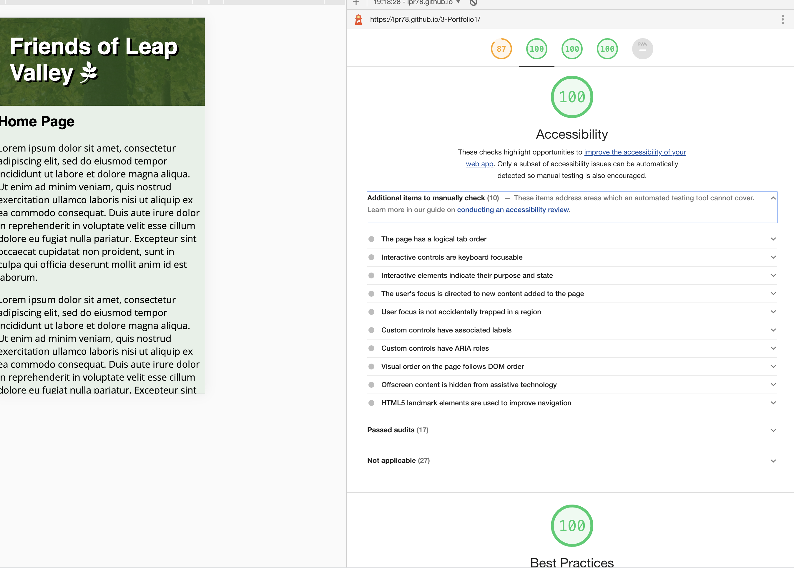
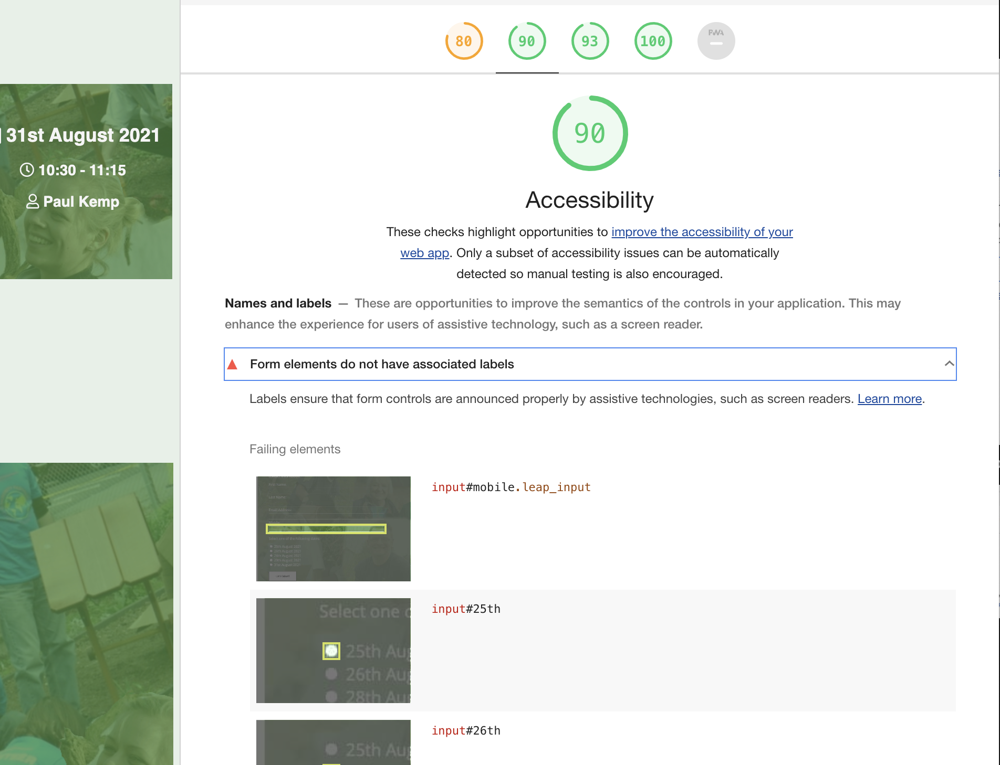

# Friends of Leap Valley

## Purpose

Leap Valley use a [simple site link](
http://www.simplesite.com/friendsofleapvalley/76040428) which is very basic and does not include responsive elements.  The site offers information regarding Leap Valley for visitors, but lacks the contextual links associated with the TVC (Tutoring Volunteering Community) in Bristol.  The purpose of the site is to increase the number of volunteers, offering images of the beautiful sections associated with Leap Valley and volunteering meeting slots, which users are able to sign up, with a What3Words location to assist the potential volunteers of the location of the meeting, within Leap Valley.  

## Links to Friends of Leap Valley
The link to the [GitHub File Directory](https://github.com/lpr78/3-Portfolio1)  
The link to the [Published site](https://lpr78.github.io/3-Portfolio1/)

## Media Screen Responsive Elements
The following show how the elements of the website current look at a responsive level:

#### Home page view
The following images shows how the contact us page looks at a responsive level: 

#### Meet us page view
The following images shows how the contact us page looks at a responsive level: 

#### Contact us page view
The following images shows how the contact us page looks at a responsive level: 

## Features

### Navigation Header
The following navigation header has been used consistently across all three web pages.   

### Home Page Elements
The following image shows the main elements used on the home page (as of 19/08/2021)  

### Members Elements
The following image shows the main elements used on the members page (as of 19/08/2021)  

### Contact Us Elements
The following image shows the main elements used on the contact us page (as of 19/08/2021)  

### Footer
The following footer has been used consistently across all three web pages.   

## Testing 
### Accessibility Check - 08/08/2021

improved accessibility score based on title and alt update:

### Accessibility Check - 19/08/2021
With the additional elements relating to the form element and additions to the meet us page, the accessibility score has decreased and need updating to ensure screen readers can understand the labels, as shown below  

Improved accessibility score changing id names on form elements (contact us page)  

## Deployment

## Credits 

### References for image and accessibility content:
<li>https://www.pexels.com/</li>
<li>https://fonts.google.com/</li>
<li>https://validator.w3.org/</li>
<li>https://jigsaw.w3.org/css-validator/</li>
<li>https://web.dev/measure/</li>
<li>https://www.tcv.org.uk/about/</li>
<li>Creators own images and customisation of primary/copyright compliant sources via image editing software (Photoshop)</li>

### References for learning:
<li>https://github.com/Code-Institute-Org/gitpod-full-template</li>
<li>https://learn.codeinstitute.net/courses/course-v1:CodeInstitute+CSSE_PAGPPF+2021_Q2/courseware/66cf361c769a41d496f5001fae6f9be7/3b5cd5dc8313462aa5975a3c9b9a1a3c/</li>
<li>https://github.com/Code-Institute-Solutions/readme-template</li>
<li>https://stackoverflow.com/questions/37506841/html-for-put-a-label-in-bottom-of-an-image/37506883</li>

