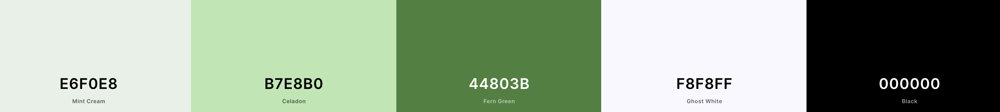
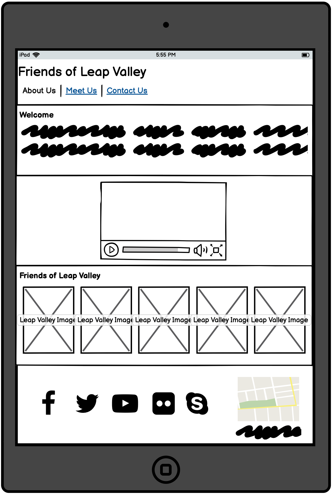

# Friends of Leap Valley

## Purpose

Leap Valley use a [simple site link](
http://www.simplesite.com/friendsofleapvalley/76040428) which is very basic and does not include responsive elements or details relating to the volunteer meeting times, or even sign up procedures for potential support from the local community in South Gloucestershire.  The site offers information regarding Leap Valley for visitors, but lacks the contextual links associated with the TVC (Tutoring Volunteering Community) in Bristol or volunteer meetings.  The previous meetings have lacked potential support from the local community, from failed attempts of using the monthly South Gloucestershire new letters.  

The purpose of the site is to increase the number of volunteers, offering images of the beautiful areas within Leap Valley and volunteering meeting slots, which users are able to sign up, using relevant locators, such as What3Words to assist the potential volunteers of the location of the meeting, within Leap Valley.  The site target audience range from young professionals to the retired community, who want to learn about tending to wildlife across the Leap Valley areas and able to transfer these skills into their own garden and nature.  The site should also emphasis where volunteers can support the recent Guerrilla gardening initiative.  

A range of media will support the sites purpose, with relevant navigation to images, video and text information.  The end result is a form element where volunteers can sign up to a wide-range of volunteer meetings which the main coordinators can use to ascertain number interest and time popularity for future events. 

The final product link to the [Published site](https://lpr78.github.io/3-Portfolio1/)
### Visit Reasons
<ol><li>Identify the location of Friends of Leap Valley</li>
<li>Understand the difference volunteering sections within Leap Valley</li>
<li>Identify the meeting times associated with volunteering</li>
<li>Understand the benefits of volunteering with Friends of Leap Valley</li>
<li>Identify the different opportunities associated with TCV (The Conservation Volunteers)</li> 
</ol>

### Developer expectations
<ol>
<li>To provide text information about Friends of Leap Valley</li>
<li>Showcase a range of images to present the natural beauty of the Leap Valley locations</li>
<li>To provide easy navigation between volunteering information, members and signup form</li>
<li>To provide links to recognised qualifications that volunteers can complete</li>
<li>To present testimonals from other volunteers to why they should volunteer</li>
<li>To provide an easy sign up form for new volunteers that sends information to Friends of Leap Valley</li>
<li>Present appropriate responsive layouts across a range of media screens: PC, Tablet and Mobile device</li>
<li>Utilise a range of accessibility measures for visitors (font size, high contrast and accessibility tools)</li>
</ol>

## Design
### Colors
To keep in the with the style of Leap Valley, i will some high contrasted colours, utilising green as the background and button elements.  They will feature across many features of the website, which will be identified at the point of the iterative development of the website pages.  Hex code values below: 

The black and white colours will be used to present the high contrast elements to the design.  Assistance to identify the colours came from using the following [website](https://coolors.co/e6f0e8-b7e8b0-44803b-f8f8ff-000000)

### Typography
The font style used will be a sans serif font.  From research, it is important that the font style is easy and clear to read and utilising this style means it is easier for readers to understand across many different devices.  

Font choices: Hebo and Open Sans.  Both fonts are easy to read with a high contrast.

I will embed the following into the CSS code: @import url('https://fonts.googleapis.com/css2?family=Heebo&family=Open+Sans&display=swap');

### Call to action
I will use the font styles and colours identified above for the buttons relating to react to the following:
<ol>
<li>Image map button</li>
<li>form button</li>
<li>Google Map link to locate Leap Valley</li>
</ol>

### Icons
I will use [FontAwesome](https://fontawesome.com/) to retrieve the following icons across the website:
<ol>
<li>Header: Use a leaf icon to create the logo for Leap Valley Friends</li>
<li>Header Nav: To support a visual representation of the navigational item to support those with reading accessibility needs</li>
<li>Footer: Social Media Icons: Facebook, PInterest, YouTube and Twitter</li>
<li>Footer: Telephone icon: To be able to use VOIP to make contact with TCV and Leap Valley Friends</li>
<li>Contact Us Page: Icons of a calendar, clock and person to support the times of the next volunteering meetings</li>
</ol>

### External Links
I will use relevant links to the following sites:
<ol>
<li>Facebook, Twitter, YouTube, PInterest</li>
<li>Skype link for calling</li>
<li>What3Words site to access exact location of meeting</li>
<li>Gateway Qualification link to support further information on the qualification that can be studied</li>
<li>Link to Conservative Volunteering site that support Friends of Leap Valley</li>
</ol>

### Iteration #1 - Initial Idea on the homepage

The following ideas was developed to see if the actual design ideas were feasible from a high contrast perspective.

 
At this time i believe the content is suitable, but would need to instruct testers to check the website in the following area:
<ul>
<li>Usability Testing</li>
<li>Readability and Syntax Advisor</li>
<li>Technical Expertise</li>
</ul>

So the following designs will be utilised for the responsive elements of the website:

#### Desktop: 

<table>
<tr><th>Home Page</th><th>Meet Us</th><th>Contact Us</th></tr>
<tr>
<td></td>
<td></td>
<td></td>
</tr>
</table>

#### Tablet:

<table>
<tr><th>Home Page</th><th>Meet Us</th><th>Contact Us</th></tr>
<tr>
<td></td>
<td></td>
<td></td>
</tr>
</table>

#### Mobile:
<table>
<tr><th>Home Page</th><th>Meet Us</th><th>Contact Us</th></tr>
<tr>
<td></td>
<td></td>
<td></td>
</tr>
</table>

## Media Screen Responsive Elements
The following show how the elements of the website current look at a responsive level:

#### Home page view
The following images shows how the contact us page looks at a responsive level: 

#### Meet us page view
The following images shows how the contact us page looks at a responsive level: 

#### Contact us page view
The following images shows how the contact us page looks at a responsive level: 

## Features used in website
<ul>
<li>images</li>
<li>video</li>
<li>form</li>
<li>text</li>
<li>map elements</li>
<li>icons</li>
<li>animated elements on images</li>
</ul>
Further details of web elements used below:   

### Navigation Header
The following navigation header has been used consistently across all three web pages.   

<ul>
<li>Appears at the top of each web page</li>
<li>Three links to home page, meet members and contact Friends of Leap Valley</li>
<li>High contrast with background image that is customised using Photoshop</li>
<li>Hover over identifies the desired location for the user</li>
<li>Strong emphasis on current page, to support user with page element currently displayed</li>
<li>Icons displayed to the right of the images to support identifying words, if translating text is difficult </li>
<li>Relevant logo that also links to the homepage</li>
</ul>

### Home Page Elements
The following image shows the main elements used on the home page (as of 19/08/2021)  

<ul>
<li>Leap Valley Map to showcase the multiple areas where volunteers can support</li>
<li>Video element demonstrated by volunteer to showcase popular areas and why they should volunteer</li>
<li>Responsive images with title tags to showcase the main areas - from Pexels and own images</li>
<li>Relevant titles and text to support what the volunteer would want to see on the home</li>
</ul>

### Members Elements
The following image shows the main elements used on the members page (as of 19/08/2021)  

 
<ul>
<li>Relevant titles and text to support celebrating recent qualification success from volunteers through TVC</li>
<li>Responsive images of volunteering activities - from Pexels and own images</li>
<li>Links to qualification to sell the volunteering opportunities</li>
</ul>

### Contact Us Elements
The following image shows the main elements used on the contact us page (as of 19/08/2021)  

 
<ul>
<li>Relevant titles and text to outline volunteer agenda for each time slot</li>
<li>Rbanner image utilised for date and form section from pexels and own images</li>
<li>form element to select volunteering meeting time</li>
<li>text block to sell the idea of volunteering</li>
</ul>

### Footer
The following footer has been used consistently across all three web pages.   

 
<ul>
<li>Appears at the bottom of each web page</li>
<li>Contains a google map element to locate Leap Valley, where Friends of Leap Valley volunteer</li>
<li>High contrast with background image that is customised using Photoshop which is the bottom section of the header image</li>
<li>Hover over identifies the social media icon to select, as well as contact number to call using VOIP</li>
<li>Strong emphasis on TVC link, to encourage volunteers to consider other opportunities around Bristol</li>
<li>Copyright notification to inform users of website creator</li>
<li>Relevant logo that also links to the homepage</li>
</ul>

## Deployment

### Success Criteria
The following tests will need to be complete throughout development and final testing.
<table>
<tr> <th>Test No</th> <th>Test Actions</th> <th>Test Expectations</th>
</tr>
<tr> <td>1</td> <td>Text should be reable and support accessibility requirements utilising a high contrast with screen resolutions at: 500px, 1500px and 2000px</td> <td> Checking each page of the site, the text should be clear with light on dark or dark on light.</td>
</tr>
<tr><td>2</td><td>Checking internal navigation links</td><td>Each icon and menu button that is internally linked should open on the same browser page</td></tr>
<tr><td>3</td><td>Checking external navigation links</td><td>Each of the hyperlinks should open on a new page, using a _blank reference</td></tr>
<tr><td>4</td><td>Clickable Footer icons should work</td><td>All icons should change colour on hover over and should be clickable.  This is for the header and footer elements, such as social media links.</td></tr>
<tr><td>5</td><td>Interactive google map element in the footter</td><td>The embedded element should be moveable using a mouse action and should be able to display clearly the location of Leap Valley</td></tr>
<tr><td>6</td><td>Video controls</td><td>The video should have appropriate interactive elements that allow the user to play/pause on the Introduction page</td></tr>
<tr><td>7</td><td>Responsive images</td><td>Images should have a title element that displays text associated with the image and should be able to scale across the three responsive size elements: 500px, 1500px and 2000px</td></tr>
<tr><td>8</td><td>Form elements</td><td>Users should clearly see where they are to add their information in the contact us form.  once the user clicks the submit button a php relays their choices they have selected for the meeting times.</td></tr>
<tr><td>9</td><td>text information accessible.  The developer will use relevant spelling and grammatical tools prior to text placement on the relevant html page.</td><td>The text information should be clear of spelling and grammatical errors.</td></tr>
<tr><td>10</td><td>Map enlargement</td><td>The user should be able to locate the map enlargement button on the home page in order to access a larger scaled image of the website itself.</td></tr>
<tr><td>11</td><td>Engage Usability Testing and further online testing (W3C)</td><td>To see if the message and purpose of the site is clearly understood by a novice user of which it should be clear, verified across many online platforms associated with W3C checking on responsiveness, accessibility and syntax rules.</td></tr>

</table>

Testing information located on the following document: <a href="TESTING.md">Testing Document</a>

### Links to Friends of Leap Valley
The link to the [GitHub File Directory](https://github.com/lpr78/3-Portfolio1)  
The link to the [Published site](https://lpr78.github.io/3-Portfolio1/)

### Further development
The following ideas could be further developed:
<ul>
<li>Use a modal for map, rather than linking to the image located on the web server</li>
<li>Images could be placed into a scrollable gallery on the about us and members page to save space on the webpage itself</li>
<li>Fix the header at the top of each page to allow the user to reduce scrolling to access the menu</li>
<li>Develop a PHP link that supports the form rather than using the Code Institute POST link</li>
<li>Link the video to a YouTube server and embed, to improve performance score on lighthouse</li>
<li>Use some animated elements on images as long as this does not impact the performance score on the lighthouse</li>
</ul>

## Credits 

### Support within Code Institute and external
<ol>
<li>Brian Macharia - Mentor support over 2 meetings identifying final iterative testing requirements</li>
<li>Matt Rudge - Template structure required for GitPod</li>
<li>Code Institute - Support on links between GitPod and Git Hub and usability requirements to complete the task as well as signing up to unlimited plan on GitPod</li>
<li>Code Institute Stack Group - for verification on using https://formdump.codeinstitute.net/ on form POST elements being allowed</li>
<li>Code Institute Github page - For support on README templates and baseline templates associated with web developments - the links to the video tutorials were valuable!</li>
<li>Paul Kemp - Novice tester for looking at the website and suggesting improvements during the testing, with a focus on the success criteria at hand</li>
<li>Kate Tuck - Literacy support and ideas for SEN support on text (focus on readablity)</li>
</ol>

### References for image and accessibility content:
<ul>
<li>https://www.pexels.com/</li>
<li>https://fonts.google.com/</li>
<li>https://validator.w3.org/</li>
<li>https://jigsaw.w3.org/css-validator/</li>
<li>https://web.dev/measure/</li>
<li>https://www.tcv.org.uk/about/</li>
<li>Creators own images and customisation of primary/copyright compliant sources via image editing software (Photoshop)</li>
</ul>

### References for learning:
<ul>
<li>https://github.com/Code-Institute-Org/gitpod-full-template</li>
<li>https://learn.codeinstitute.net/courses/course-v1:CodeInstitute+CSSE_PAGPPF+2021_Q2/courseware/66cf361c769a41d496f5001fae6f9be7/3b5cd5dc8313462aa5975a3c9b9a1a3c/</li>
<li>https://github.com/Code-Institute-Solutions/readme-template</li>
<li>https://stackoverflow.com/questions/37506841/html-for-put-a-label-in-bottom-of-an-image/37506883</li>
</ul>

