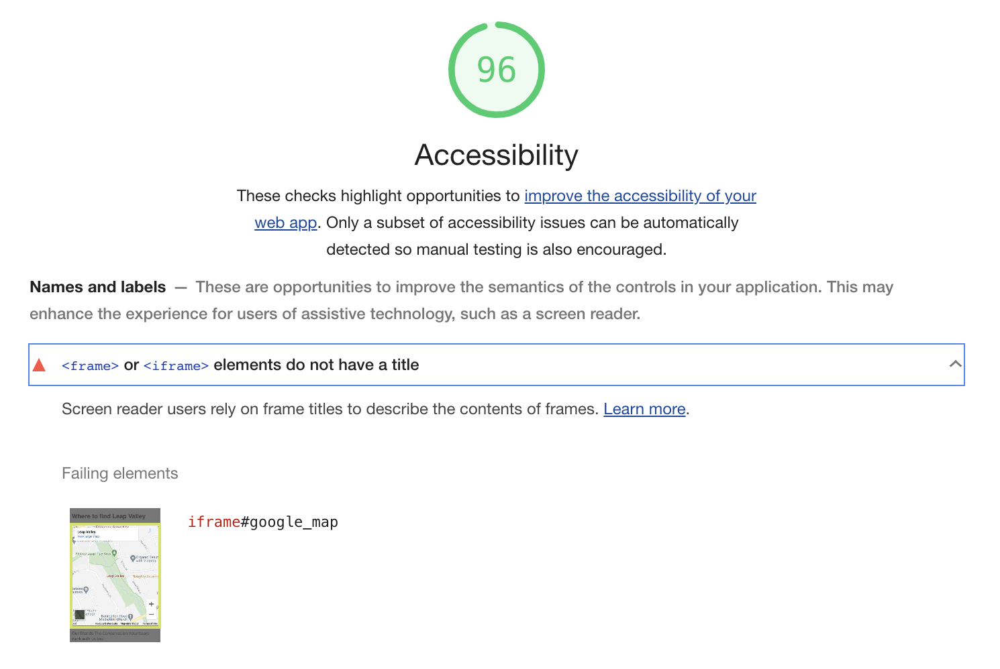
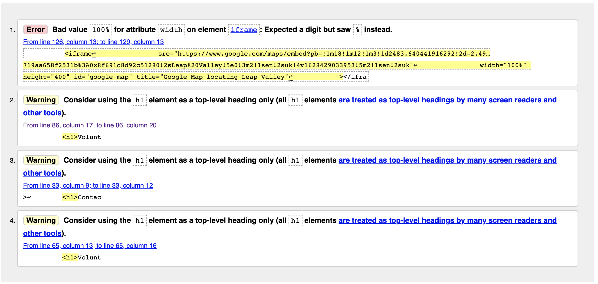

### Testing 
#### Accessibility Check - 08/08/2021

improved accessibility score based on title and alt update:

#### Accessibility Check - 19/08/2021
With the additional elements relating to the form element and additions to the meet us page, the accessibility score has decreased and need updating to ensure screen readers can understand the labels, as shown below  

Improved accessibility score changing id names on form elements (contact us page)  

#### W3C HTML Check Results - 31/08/2021
The following images shows some of the initial warnings and errors associated with the three web pages.  I used [W3C HTML validator](https://validator.w3.org/) the following The error message is consistent and will review with support. 

#### W3C CSS Check Results - 31/08/2021
The results from the W3C CSS checker showcase no errors in the stylesheet.  

#### Paul Kemp - Usability Testing - 09/09/2021
Email feedback received (text copied from email): 

<blockquote>
The three pages are accessible and i can see the images clearly (when you changed the view).  The text is clear on all pages and the form element gives me a page telling me my options.  When i was on the contact us page and made the browser smaller, the feedback box did go over the form and this would need to be adjusted.  All links seem to work ok and i like that the icons change colour when you hoover over them.

Other comments (apologies for the list) 
<li>The video is ok, but could this be in the center of the page, rather than to the left.  You mentioned the idea of the apple website and they seem to have things in the middle, could this be done too? </li>
<li>The number of images on the home page seem alot - could these be reduced and gallery used (to make it reduce the space on the page? </li>
<li>The shape outline for the images on the home and meet us page seem to be different sizes - not a fan of the curved edges - could these be less severe?</li>
<li>On the contact us page - the actual blocks where you enter the information is not that clear and the font size seems really small - could the colour background be changed and font made bigger? </li>

Many thanks and best of luck with this project and hope you do well. 

</blockquote>

#### Brian Macharia - Technical Feedback Evidence - 16/09/2021
After our technical meeting, Brian kindly noted the advised adjustments to make to the website, in order to comply with usability.  The feedback was valued and does also cross reference the notes made from usability testing:

#### Kate Tuck - Grammaratical Support - 19/09/2021
The following notes were made from the discussion with Kate:
<blockquote>There are a few readability issues on the home page in the first paragraph. Otherwise the other two webpages are ok. 
My advice, use a website called [Grammarly](https://www.grammarly.com/), you can set your readability targets and you can make the necessary adjustments to each paragraph to make sure they are understood.  
This is a tool that i recommend GCSE and A-Level students to use before submitting any coursework and does well to identify word placement, grammar and syntax structures.  I would strongly recommend you use this in this website and for future tasks.
Best of luck with the website and hope you do well.  
Do not hesitate to contact if you need any other proof reading advice.   </blockquote>

#### Changes applied to website based on feedback

##### Change 1: Using a carousel on Index and Meet Us page

Code snippet used to inspire the changes to the home page from [Raddy.com](https://raddy.co.uk/blog/learn-a-super-cool-effect-using-flexbox-in-under-7min/).
The number of images has been reduced and organised into two sections relating to Leap Valley, being the Thickets and Meadow areas, as shown below:

Version 1 changes:

Version 2 changes:

